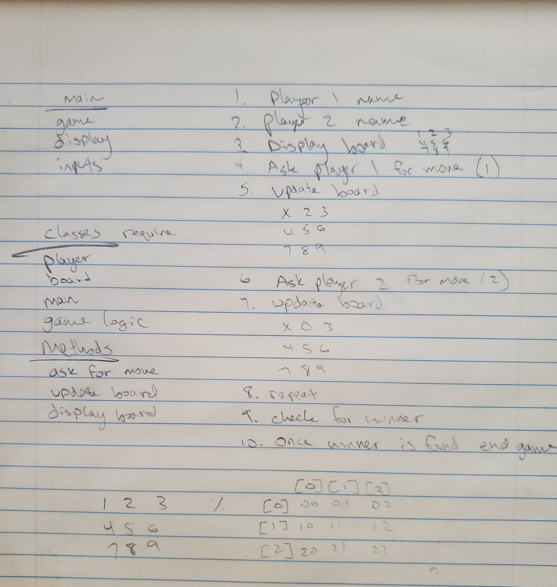

# GAME FLOW
1. Player 1 name
2. Player 2 name
3. Display board as 3x3 grid numbering 1-9
4. Ask player 1 for move
5. Update board replacing the position with an X for player 1
6. Ask player 2 for move
7. Update board replacing position with an O for player 2
8. Repeat until 3-in-a-row or a tie (all moves exhausted)
9. Ask for game repetition

# Classes
1. Player? (handled in tic_tac_toe.rb)
2. Board (game.rb)
3. Main (tic_tac_toe.rb)
4. Game logic (game_logic.rb)

# Methods
1. Ask for move
2. Update board
3. Display board

